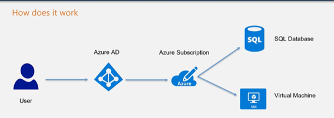

# Azure Active Directory

This is a cloud-based identity and access management service. You can create users and groups in Azure AD. You can also assign licenses to user give access to resources in Azure to users defined in Azure AD, grant different roles to users in Azure AD.

## There are different pricing options when it comes to Azure AD:
- **Azure Active Directory Free**: This provides user and group management. It also provides on-premises directory synchronization, basic reports and self-service password change for cloud users.
- **Azure Active Directory Premium P1**: Here hybrid users can access both on-premises and cloud resources. It also supports the use of dynamic groups, cloud write-back capabilities and self-service password reset for on-premises users.
- **Azure Active Directory Premium P2**: This provides import features such as Azure Active Directory Identity Protection and Privileged Identity Management.