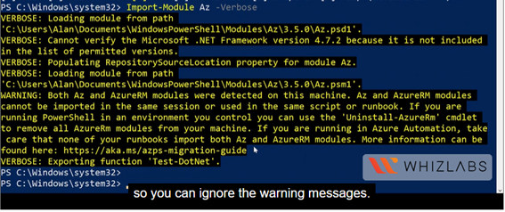
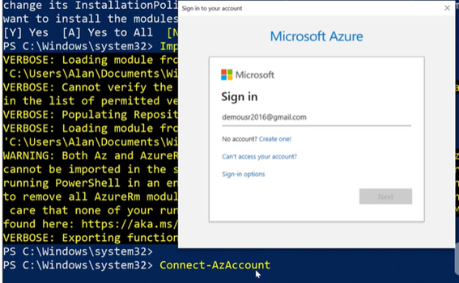
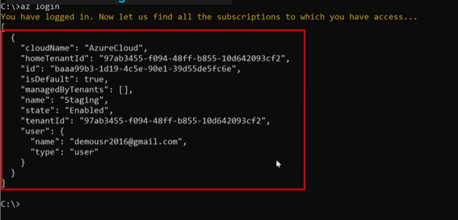
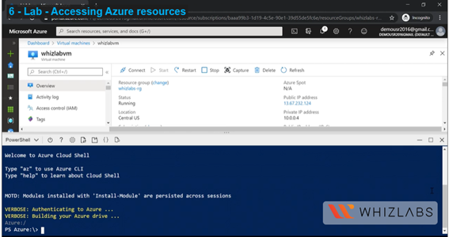

# Other ways of accessing resources in Azure
1.	PowerShell to access resources in Azure.
2.	You can user the Azure command line interface.
3.	You can also use Azure cloud shell.

## Powershell to access resources in Azure
The first thing that we must do is to install the Azure modules for PowerShell. For this action, we launched the PowerShell as administrator:
1. Set the execution policy if not already set to allow remotely signed packages to run in our system:

2. Once that’s done, we’ll install the modules for Azure:

3. When the modules are installed, we can go and import the Azure modules:

4. Perform the following command to connect to your Azure account:

5. Once it’s connected to your account, you can see your subscription:

## Azure command line interface

This tool can be installed in Windows, macOS and Linux environments:

For windows, we need to download the MSI installer. Once it’s done, you can connect to your Azure account using the Azure Command Line Interface:

## Access with Azure Cloud Shell

You can access to the Azure Cloud Shell from the Azure portal:

Also, you can get access to Azure Cloud shell from “shell.azure.com”.

