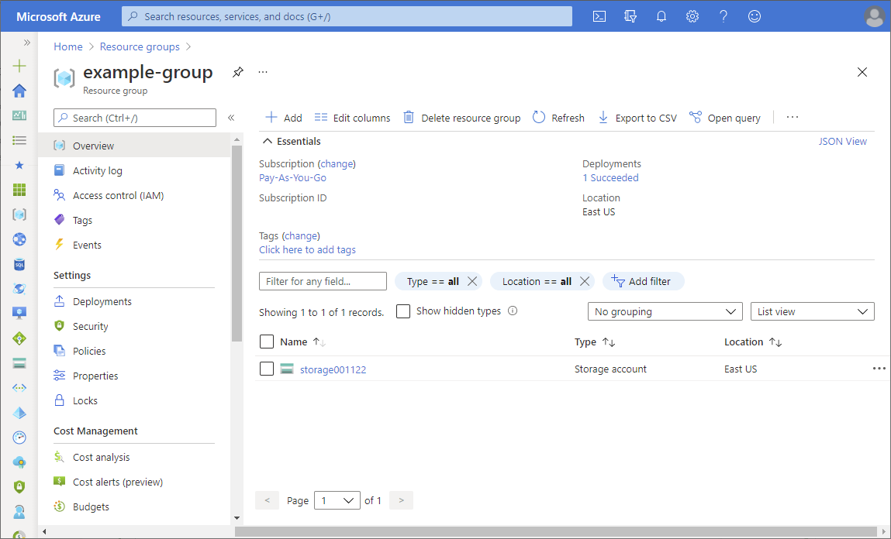
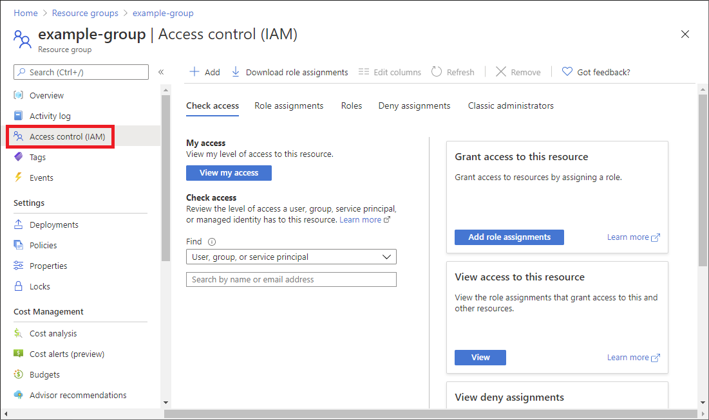
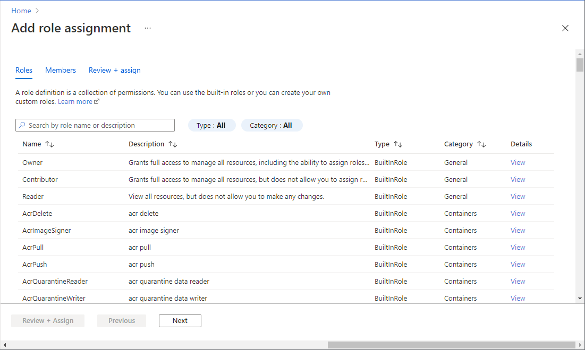
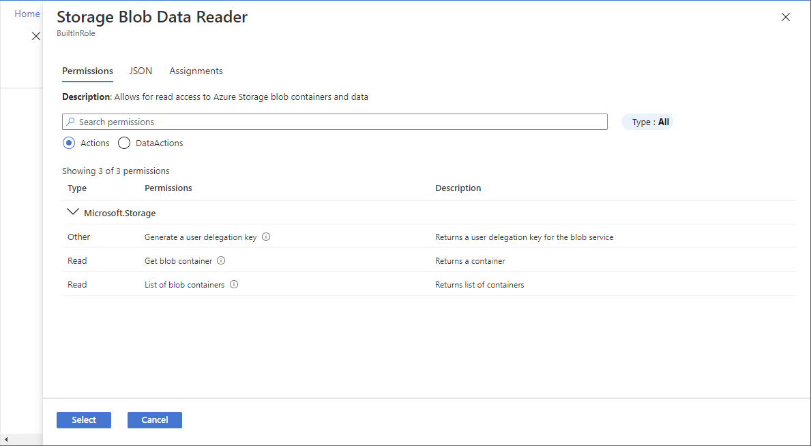
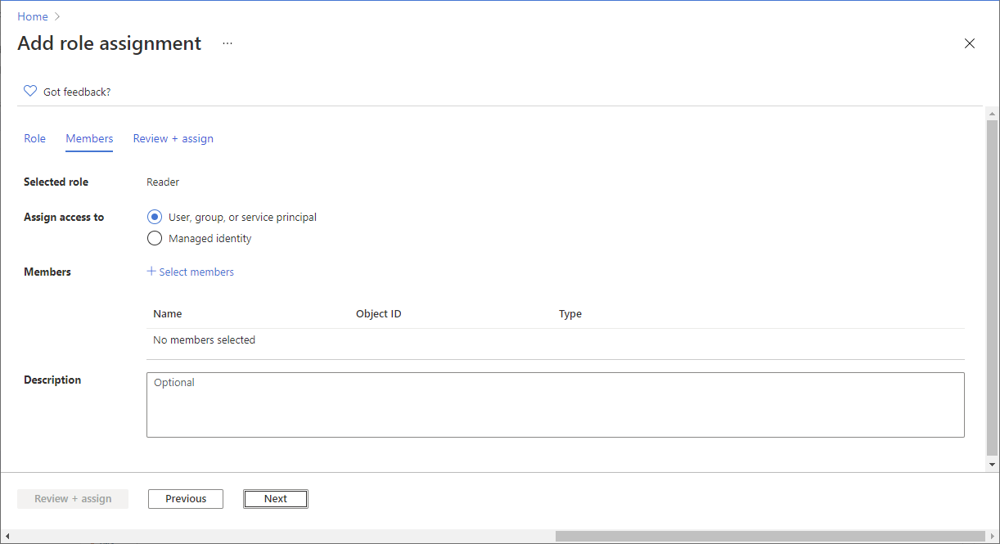
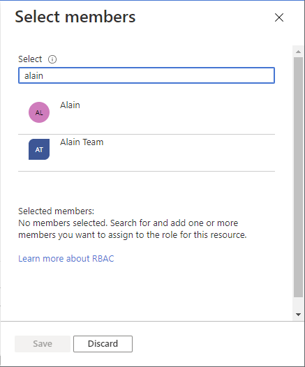
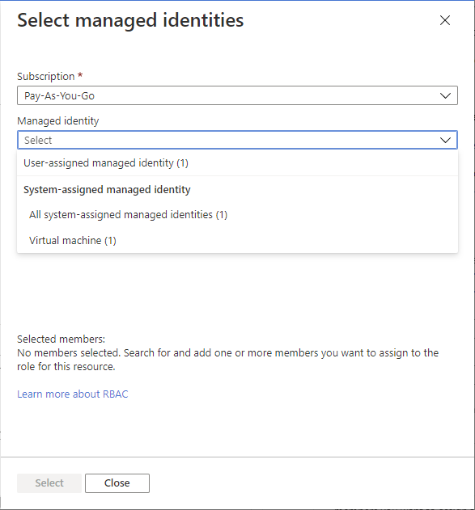

# Working with role based access control

## Step 1: Identify the needed scope

When you assign roles, you must specify a scope. Scope is the set of resources the access applies to. In Azure, you can specify a scope at four levels from broad to narrow: management group, subscription, resource group, and resource.

1. Sign in to the Azure portal.

2. In the Search box at the top, search for the scope you want to grant access to. For example, search for Management groups, Subscriptions, Resource groups, or a specific resource.

3. Click the specific resource for that scope.

4. The following shows an example resource group.

## Step 2: Open the Add role assignment page

Access control (IAM) is the page that you typically use to assign roles to grant access to Azure resources. It's also known as identity and access management (IAM) and appears in several locations in the Azure portal.

1. Click Access control (IAM).

The following shows an example of the Access control (IAM) page for a resource group.

2. Click the Role assignments tab to view the role assignments at this scope.

3. Click Add > Add role assignment.

If you don't have permissions to assign roles, the Add role assignment option will be disabled.

The Add role assignment page opens.

## Step 3: Select the appropriate role

1. On the Roles tab, select a role that you want to use.

You can search for a role by name or by description. You can also filter roles by type and category.

2. In the Details column, click View to get more details about a role.

3. Click Next.

## Step 4: Select who needs access

1. On the Members tab, select User, group, or service principal to assign the selected role to one or more Azure AD users, groups, or service principals (applications).

2. Click Select members.

3. Find and select the users, groups, or service principals.

You can type in the Select box to search the directory for display name or email address.

4. Click Select to add the users, groups, or service principals to the Members list.

5. To assign the selected role to one or more managed identities, select Managed identity.

6. Click Select members.

7. In the Select managed identities pane, select whether the type is user-assigned managed identity or system-assigned managed identity.

8. Find and select the managed identities.

For system-assigned managed identities, you can select managed identities by Azure service instance.

9. Click Select to add the managed identities to the Members list.

10. In the Description box enter an optional description for this role assignment.

Later you can show this description in the role assignments list.

11. Click Next.
