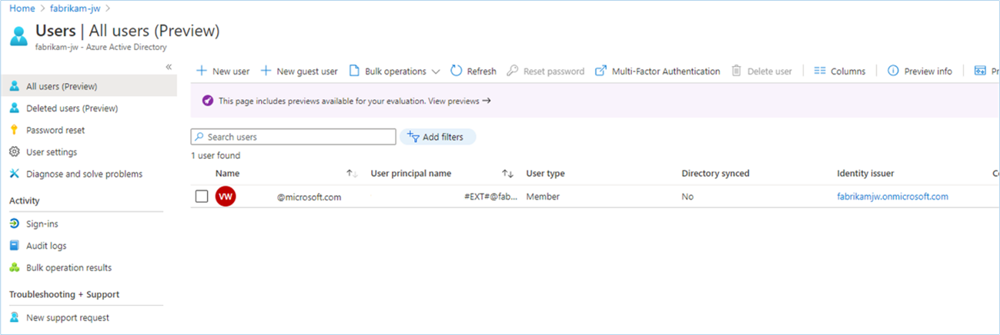
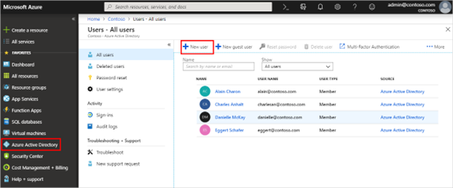
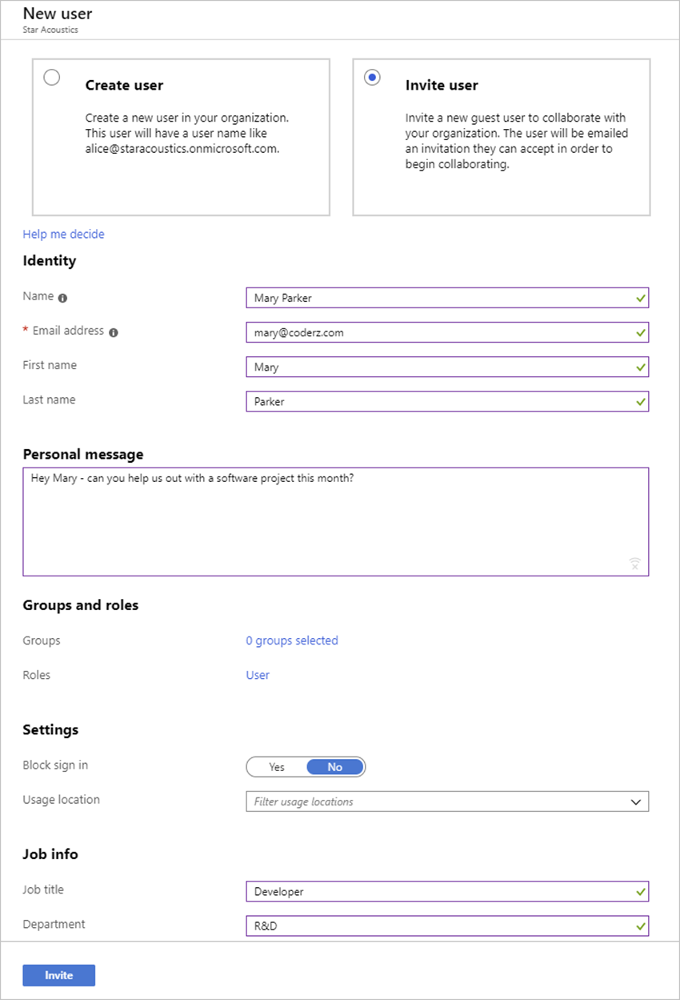

# Working with users and groups

## View users

To view the Azure AD users, in the left menu pane, under Manage, select Users. The All Users pane appears. Take a minute to access the portal and view your users. Notice the User type and Identity issuer columns, as shown in the following screenshot.

Typically, Azure AD defines users in three ways:
- **Cloud identities** - These users exist only in Azure AD. Examples are administrator accounts and users that you manage yourself. Their source is Azure Active Directory or External Azure Active Directory if the user is defined in another Azure AD instance but needs access to subscription resources controlled by this directory. When these accounts are removed from the primary directory, they are deleted.
- **Directory-synchronized identities** - These users exist in an on-premises Active Directory. A synchronization activity that occurs via Azure AD Connect brings these users in to Azure. Their source is Windows Server AD.
- **Guest users** - These users exist outside Azure. Examples are accounts from other cloud providers and Microsoft accounts, such as an Xbox LIVE account. Their source is Invited user. This type of account is useful when external vendors or contractors need access to your Azure resources. Once their help is no longer necessary, you can remove the account and all of their access.

## Add users

You can add cloud identities to Azure AD in multiple ways:
- Syncing an on-premises Windows Server Active Directory
- Using the Azure portal
- Using the command line
- Other options

### Sync an on-premises Windows Server Active Directory

Azure AD Connect is a separate service that allows you to synchronize a traditional Active Directory with your Azure AD instance. This is how most enterprise customers add users to the directory. The advantage to this approach is users can use single sign-on (SSO) to access local and cloud-based resources.

### Use the Azure portal

You can manually add new users through the Azure portal. This is the easiest way to add a small set of users. You need to be in the User Administrator role to perform this function.

1.	To add a new user with the Azure portal, in the top menu bar, select New user.

2.	In addition to Name and User name, you can add profile information, like Job Title

3.	You can also invite a user into the directory. In this case, an email is sent to a known email address and an account is created and associated with that email address if they accept the invitation.

The invited user will need to create an associated Microsoft account (MSA) if that specific email address isn't associated with one and the account will be added to the Azure AD as a guest user.

### Use the command line

If you have a lot of users to add, a better option is to use a command-line tool. You can run the New-AzureADUser Azure PowerShell command to add cloud-based users.